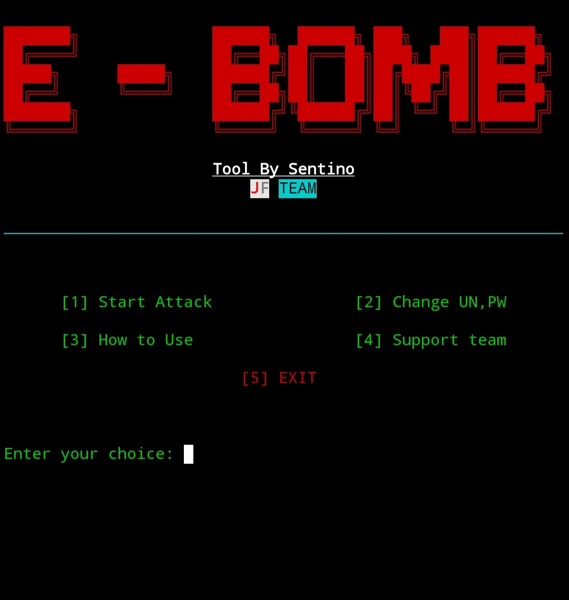

# E-BOMB





<br>
<br>

##### This is an email bomber tool and the main thing here is that even if the email is sent from the same email, the email will appear as a different email in the email app.  Here you can decide the email content you want and it will not be downloaded.

<br>
<br>

### TERMUX USE
<br>
```
apt-get update -y
```
```
apt-get upgrade -y
```
```
apt install python -y
```
```
git clone https://github.com/SENTIN0/E-BOMB.git
```
```
cd E-BOMB
```
```
pip install requirements.txt
```
```
python main.py
```
